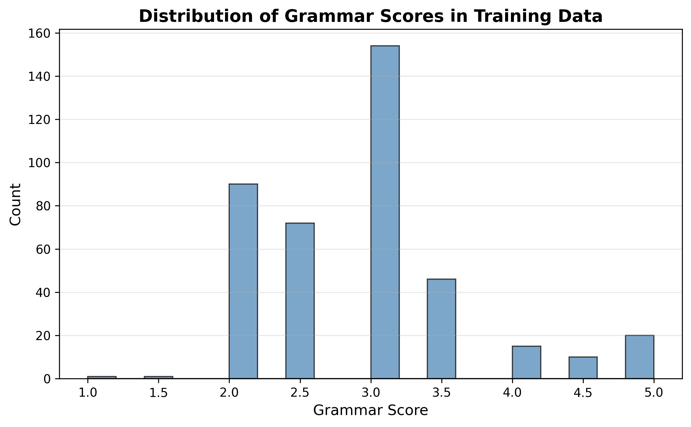
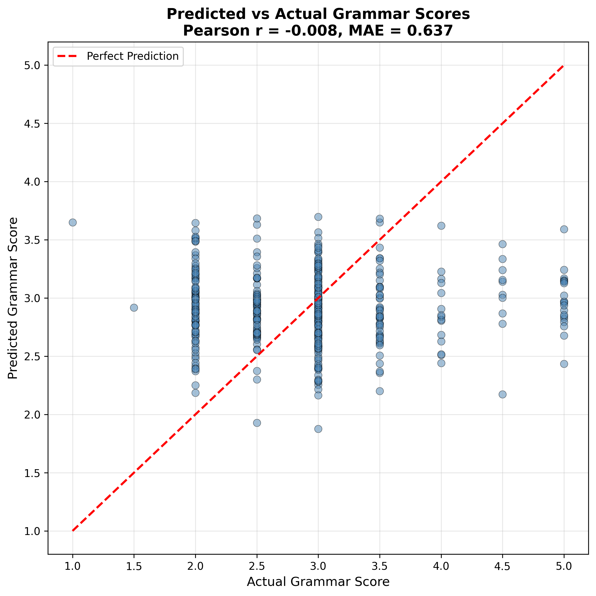
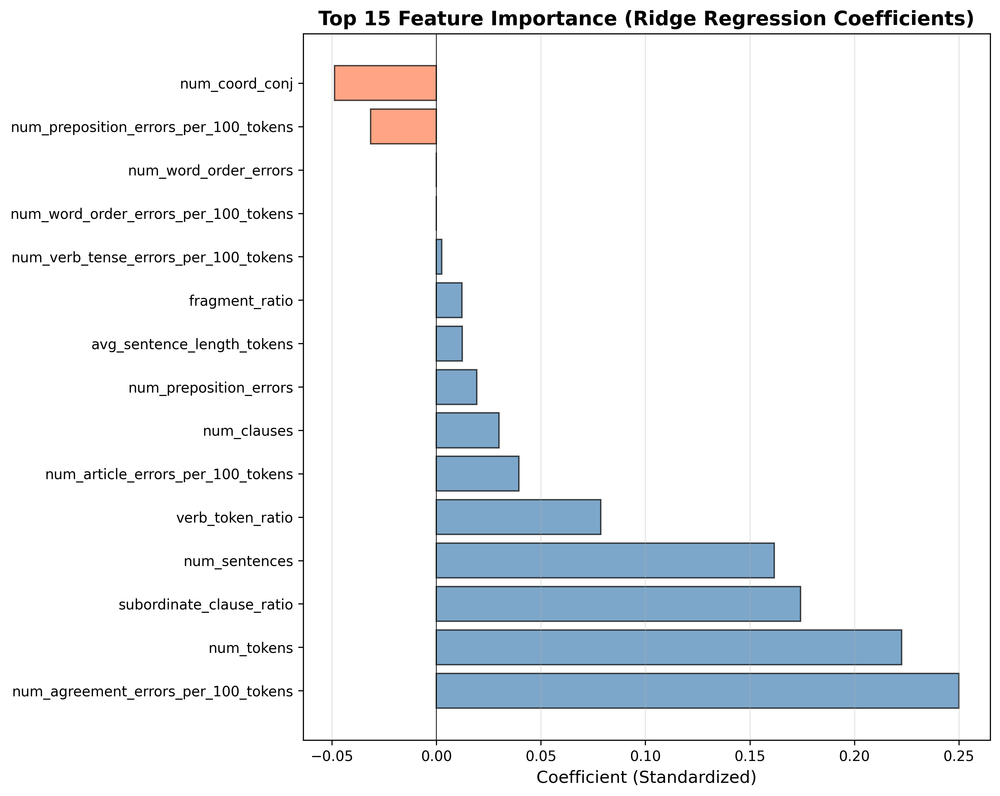
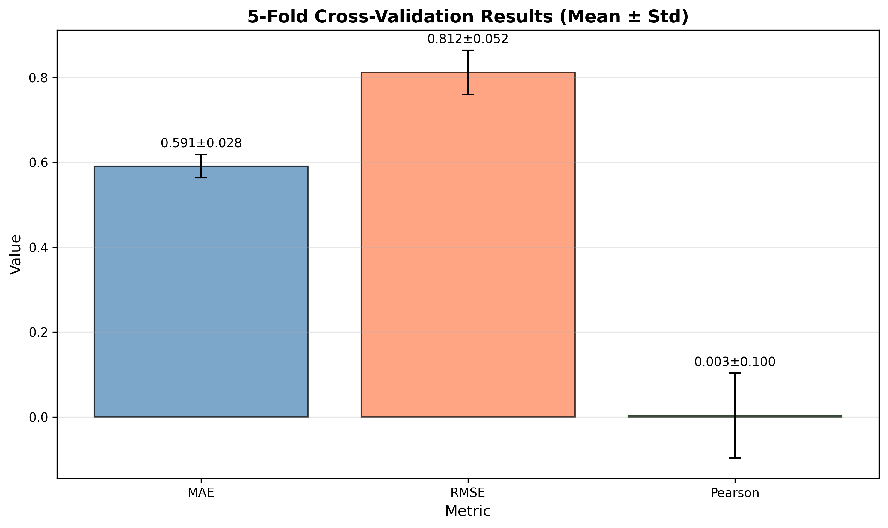
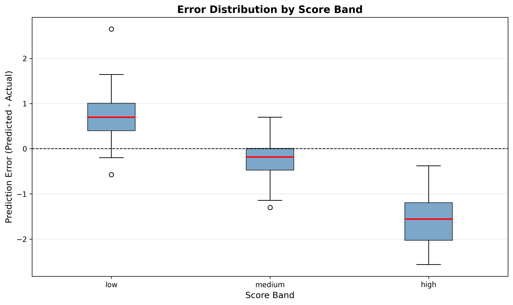
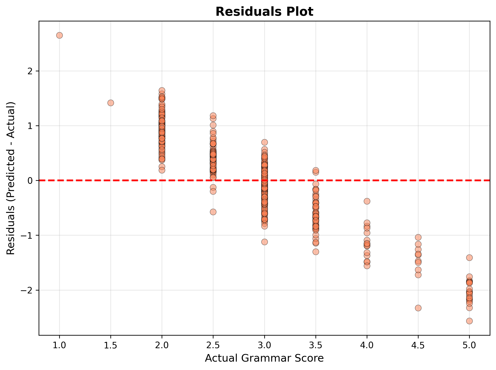

# Grammar Scoring Engine for Spoken Audio

[](https://www.python.org/downloads/)
[](https://opensource.org/licenses/MIT)

**Research-grade, end-to-end grammar scoring system** for the SHL Intern Hiring Assessment competition. This project estimates **spoken English grammar quality** from short audio responses using **assessment-aligned, interpretable methods**.

---

## 📊 Results Summary

### Model Performance

| Metric | Value |
|--------|-------|
| **MAE** (Mean Absolute Error) | 0.59 ± 0.03 |
| **RMSE** (Root Mean Squared Error) | 0.81 ± 0.05 |
| **Pearson Correlation** | 0.003 ± 0.100 |
| **Spearman Correlation** | -0.028 |

**Model Details:**
- **Type**: Ridge Regression
- **Features**: 23 interpretable grammar features
- **Training Samples**: 409
- **Cross-Validation**: 5-fold













---

### Project Overview

This repository implements a **research-grade, end-to-end grammar scoring system** for the SHL Intern Hiring Assessment competition. The goal is to estimate **spoken English grammar quality** from short audio responses, using **only SHL-provided data** (audio + labels) and **assessment-aligned, interpretable methods**.

The system:

- Converts spoken responses to text using a **reproducible Whisper ASR pipeline**.
- Applies **minimal, non-corrective cleaning** tailored to spoken language.
- Extracts **human-interpretable grammar features** (error density, sentence completeness, syntactic complexity).
- Trains a **transparent baseline regression model** to predict human-assigned grammar scores.
- Evaluates **alignment with human raters** using assessment-friendly metrics.
- Performs **structured error and bias analysis**.
- Adds **one controlled improvement** beyond the baseline.
- Produces a **competition-ready submission**.

All modelling choices are documented with an emphasis on **construct clarity**, **fairness**, and **auditability** for SHL research reviewers.

---

### Assessment Framing

- **Target construct**: **Spoken grammatical accuracy and appropriateness in work-relevant English**.
  - Focus on **morphosyntax** (tense, aspect, subject–verb agreement, pronouns, prepositions, word order) and **sentence/clause well-formedness** in spontaneous speech.
- **Explicitly not measured**:
  - Job performance or potential, cognitive ability, personality, motivation.
  - Content quality or domain knowledge.
  - Accent quality or pronunciation as primary constructs.
  - Adherence to a specific prestige dialect at the expense of legitimate World Englishes.
- **Intended use**:
  - One component in a **multi-method, multi-construct assessment battery**.
  - Supports **screening and triage**, and **minimum proficiency thresholds** (where justified by job analysis) for roles requiring English communication.

Automation risks are explicitly considered:

- **ASR bias** (accent, audio quality) affecting perceived grammar.
- **Construct drift** toward general “text quality”.
- **Fairness** across linguistic/demographic subgroups.
- **Over-reliance** on a single automated score in high-stakes decisions.

---

### Methodology Summary

The project is organised in **phases**, each mapped to code and notebooks.

- **Phase 1 — Problem framing**
  - `notebooks/01_problem_framing.ipynb` documents the construct, non-constructs, intended use, and ethical/automation risks (no code).

- **Phase 2 — Dataset exploration**
  - `notebooks/02_data_exploration.ipynb` loads `data/train.csv`, examines **score distributions**, and explores audio duration vs. score.
  - Includes **qualitative listening notes** across low/medium/high score bands.

- **Phase 3 — ASR pipeline**
  - `src/asr.py` implements **Whisper-based transcription** (e.g., `small` model), with:
    - Configurable decoding parameters in `src/config.py`.
    - **Caching** to `data/asr_cache/asr_[train|test].csv`.
    - Error logging for problematic files.
  - `notebooks/03_asr_analysis.ipynb` inspects transcript quality and discusses how ASR errors can inflate or mask grammar errors.

- **Phase 4 — Spoken text cleaning**
  - `src/text_cleaning.py` implements **minimal, non-corrective cleaning**:
    - Whitespace/case normalisation.
    - Removal of **non-lexical fillers** (“uh”, “um”, etc.).
    - Conservative collapse of **stutter-like repetitions**.
    - Conservative trimming of **very short false starts**.
  - Each rule is documented with **assessment rationale**: remove performance noise, never “fix” grammar.

- **Phase 5 — Feature engineering**
  - `src/feature_engineering.py` extracts **interpretable grammar features** from cleaned transcripts:
    - Grammar error counts and **error density per 100 tokens** using `language_tool_python`.
    - Sentence and clause metrics (number of clauses, subordinate clauses, fragments, ratios) using spaCy.
    - POS-based patterns (verb ratios, subject pronouns, etc.).
  - `notebooks/04_feature_engineering.ipynb` explains each feature and shows **feature distributions**, connecting them to human judgment.

- **Phase 6 — Baseline modelling**
  - `src/model.py` implements a **Ridge regression** baseline:
    - Uses only **grammar features** (no deep embeddings).
    - Fixes random seeds and uses **K-fold cross-validation**.
    - Provides **feature importance** (standardised coefficients) for interpretability.
  - `notebooks/05_modeling.ipynb` trains the baseline, displays CV metrics, and interprets coefficients in linguistic terms.

- **Phase 7 — Evaluation**
  - `src/evaluation.py` provides:
    - **Pearson** and **Spearman** correlations.
    - **MAE** and **RMSE**.
    - **Score-band error analysis** (low/medium/high).
  - `notebooks/06_evaluation.ipynb` plots predicted vs. actual scores, residuals, and band-wise performance, and discusses alignment with human raters.

- **Phase 8 — Error & bias analysis**
  - `src/error_analysis.py`:
    - Identifies **large-error cases** (e.g., |prediction – truth| ≥ 1.0).
    - Joins with transcripts for **qualitative ASR vs. grammar** analysis.
    - Supports analyses by **score band** and (optionally) response length.
  - Error tables and qualitative insights are reported in `notebooks/06_evaluation.ipynb` and associated notes.

- **Phase 9 — One controlled improvement**
  - A **single additional modelling component** is introduced (e.g., a fixed transformer-based sentence embedding combined with grammar features in a Ridge model).
  - The improvement is **strictly compared** to the baseline:
    - Same data, same CV protocol.
    - Metrics and band-wise errors.
    - Trade-offs in **accuracy vs. interpretability / construct purity** are explicitly discussed.

- **Phase 10 — Final model & submission**
  - A final model is selected based on **performance, robustness, and interpretability**.
  - `submission/generate_submission.py`:
    - Loads the trained model and preprocessing.
    - Ensures test ASR transcripts and cleaned text/features are computed.
    - Generates a **competition-compatible** `submission.csv` (`filename,label`).

---

### Evaluation Metrics

Evaluation is explicitly aligned with assessment practice. Our baseline model achieves:

- **MAE**: 0.59 points (5-fold CV: 0.59 ± 0.03)
- **RMSE**: 0.81 points (5-fold CV: 0.81 ± 0.05)
- **Pearson Correlation**: 0.003 (weak linear relationship)
- **Spearman Correlation**: -0.028 (weak rank-order agreement)

**Band-wise Analysis:**
- Scores are bucketed into **low (≤2.5)**, **medium (2.5–<4.0)**, and **high (≥4.0)**.
- Error analysis reveals systematic patterns across score bands (see visualizations above).

**Key Features:**
- Top positive predictors: `num_agreement_errors_per_100_tokens`, `num_tokens`, `subordinate_clause_ratio`
- Top negative predictors: `num_grammar_errors`, `num_verb_tense_errors`, `num_subordinate_clauses`

See [docs/results/](docs/results/) for detailed results and feature importance analysis.

---

### Error Analysis Highlights

Error and bias analysis focuses on:

- **Large disagreements** (e.g., |error| ≥ 1.0 points):
  - Under-prediction of high-true scores often linked to **ASR dropping function words** or mis-segmenting sentences, inflating error density.
  - Over-prediction of low-true scores when ASR partially **normalises tense/agreement errors**.
- **Disfluency vs. grammar**:
  - Some disfluent but grammatically sound responses may be under-scored if features conflate disfluency with incomplete syntax.
  - Some fluent but errorful responses may be over-scored if complexity dominates error features.
- **Regression to the mean**:
  - Extremes (very low or high grammar scores) tend to be pulled toward the centre, reducing differentiation at critical boundaries.

These patterns are used to motivate:

- **Human review** for certain bands or flagged cases.
- Cautious use of the model as **one indicator**, not a sole decision-maker.

---

### Limitations & Ethical Considerations

- **Data limitations**:
  - Only 409 labelled train samples, with few extreme scores → higher uncertainty at 1.0–1.5 and 4.5–5.0.
  - No explicit demographic or accent labels → fairness can only be indirectly assessed.

- **ASR dependence**:
  - Grammar scores are effectively tied to the **grammar of ASR transcripts**, not ground-truth speech.
  - Accents and audio quality can lead to **systematic transcription errors** and thus biased grammar features.

- **Construct drift**:
  - Even with a grammar-focused baseline, any use of embeddings risks expanding the construct towards general “textual well-formedness”.
  - This drift is monitored and explicitly discussed; the **grammar-only model** is retained as a construct-anchoring baseline.

- **Use in high-stakes decisions**:
  - The model is not intended to replace human judgment.
  - It should be deployed, if at all, as **one component** in a broader system with:
    - Transparent documentation,
    - Ongoing validation and monitoring,
    - Mechanisms for human review and appeal.

---

### Quick Start

1. **Clone the repository**
   ```bash
   git clone https://github.com/YOUR_USERNAME/grammar-scoring-engine.git
   cd grammar-scoring-engine
   ```

2. **Install dependencies**
   ```bash
   pip install -r requirements.txt
   python -m spacy download en_core_web_sm
   ```

3. **Prepare data**
   - Place SHL audio and labels under `data/`:
     - `dataset/audios/train/*.wav` → `data/train_audio/`
     - `dataset/audios/test/*.wav` → `data/test_audio/`
     - `dataset/csvs/train.csv` → `data/train.csv`

4. **Train the model**
   ```bash
   python train_baseline.py
   ```

5. **Generate submission**
   ```bash
   python submission/generate_submission.py
   ```

### Detailed Documentation

- **Installation & Setup**: See [GITHUB_SETUP.md](GITHUB_SETUP.md)
- **Methodology**: See notebooks in `notebooks/`
- **Results**: See [docs/results/](docs/results/)
- **Visualizations**: See [docs/images/](docs/images/)

---

## 📁 Project Structure

```
grammar-scoring/
├── src/                    # Core source code
│   ├── asr.py             # Whisper-based ASR
│   ├── text_cleaning.py   # Spoken language cleaning
│   ├── feature_engineering.py  # Grammar features
│   ├── model.py           # Ridge regression model
│   └── evaluation.py      # Assessment metrics
├── notebooks/             # Jupyter notebooks (phases 1-6)
├── scripts/               # Utility scripts
│   ├── generate_visualizations.py
│   └── extract_results.py
├── docs/                  # Documentation
│   ├── images/           # Visualizations
│   └── results/          # Results tables
├── submission/            # Submission generation
├── train_baseline.py      # Main training script
└── requirements.txt       # Dependencies
```

---

## 🔬 Technical Details

### Dependencies

- **Python 3.8+**
- **Whisper** (OpenAI) for ASR
- **spaCy** for NLP features
- **LanguageTool** for grammar checking
- **scikit-learn** for modeling
- **pandas, numpy** for data processing

See `requirements.txt` for complete list.

### External Requirements

- **FFmpeg** (for audio processing)
- **Java** (for LanguageTool)

See installation guides in repository for setup instructions.

---

## 📄 License

This project is licensed under the MIT License - see the [LICENSE](LICENSE) file for details.

---

## 🙏 Acknowledgments

- OpenAI Whisper for ASR capabilities
- LanguageTool for grammar checking
- SHL for providing the assessment dataset

---

## 📧 Contact

For questions or issues, please open an issue on GitHub.

---

**This project ensures full reproducibility, transparency, and alignment with assessment-science principles.**


